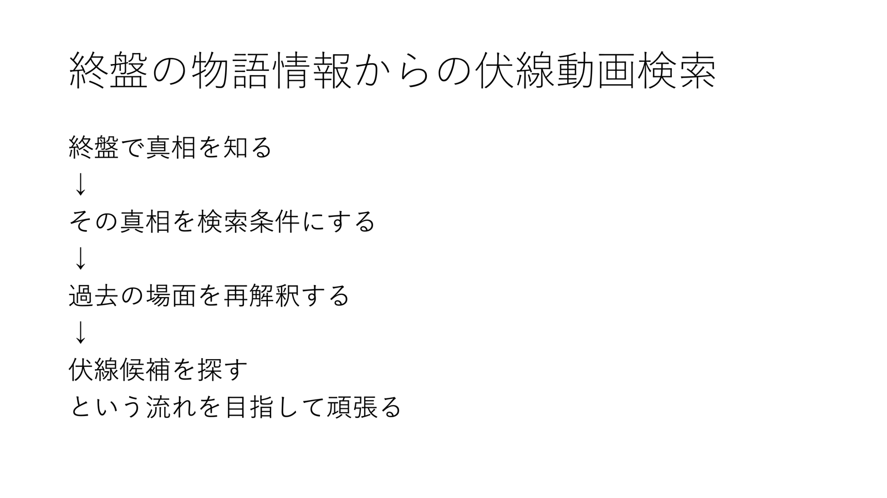

# Coarse-to-Fine Foreshadowing Retrieval with Narrative Causality

物語終盤で判明した真相から過去の映像へ遡り、伏線候補を時刻・映像証拠・理由とともに検索するStreamlit研究デモです。

日本語名：**物語因果関係を用いた粗密二段階伏線検索**

> 本アプリが提示するのは、映像と字幕から推定した「伏線候補」です。作者が意図した伏線であることを断定するものではありません。

## コンセプト



```text
終盤で真相を知る
  ↓
その真相を検索条件にする
  ↓
過去の場面を再解釈する
  ↓
伏線候補を探す
```

一般的な動画検索が「入力した言葉とよく似た場面」を探すのに対し、本研究では「その過去場面が、後から明らかになった真相を可能にしたか」「真相を知ったことで場面の意味が変わるか」まで評価します。

## 研究目的

一定間隔のフレーム抽出は、短時間だけ映る小道具・視線・手の動きなどを見落とす場合があります。一方、動画全体を最初から高密度で解析すると、処理時間とAPI費用が増加します。

本デモでは次の粗密二段階方式を試します。

### 研究テーマ

**終盤の物語情報を用いた遡及的伏線動画検索**

### 提案方式

**物語因果関係を用いた粗密二段階伏線検索**

*Coarse-to-Fine Foreshadowing Retrieval with Narrative Causality*

### リサーチクエスチョン

終盤で判明した真相を検索条件として与えることで、過去に短時間だけ現れた伏線を、動画全体の詳細解析より少ない処理量で発見し、時刻・映像証拠・物語上の理由とともに説明できるか。

```text
動画
  ↓
粗い場面インデックスを作成
  ↓
終盤の真相を人物・物体・手段・必要条件へ構造化
  ↓
複数の検索文で過去場面を広く検索
  ↓
上位候補の前後だけを0.5〜1秒間隔で再解析
  ↓
因果関係・再解釈度・映像証拠で再ランキング
  ↓
伏線候補・時刻・根拠・F–T–P・API費用を表示
```

## 用語

| 用語 | このデモでの意味 |
|---|---|
| Foreshadow（F） | 後の真相を示唆する、真相より前の場面 |
| Trigger（T） | 過去の手掛かりの意味に気づかせる情報・発見 |
| Payoff（P） | 伏線が回収され、真相が明らかになる場面または内容 |
| 粗検索 | 動画全体を低い時間密度で索引化し、詳しく見る候補を広く選ぶ処理 |
| 詳細再解析 | 候補区間の前後だけを高い時間密度で確認する処理 |
| 再解釈度 | 真相を知らない場合と知った場合で、同じ場面の意味がどれだけ変わるか |
| Enabling因果 | 過去の出来事や知識が、後の出来事を可能にした関係 |

## 主な機能

- 動画から6〜10秒間隔で代表フレームを抽出
- Geminiによる事実中心の場面記録作成
- 終盤の真相を人物・行動・手段・証拠・必要条件へ構造化
- Gemini Embeddingによる複数クエリ検索
- 上位候補区間だけを高密度で再解析
- Physical / Motivational / Psychological / Enablingの物語因果関係を評価
- 真相を知る前後の意味変化を「再解釈度」として評価
- Foreshadow–Trigger–Payoff（F–T–P）形式で結果を説明
- Trigger／Payoffが伏線より上位になることを防ぐ役割補正
- APIトークン、概算費用、処理時間を表示
- 研究記録をJSON・CSV・HTML・証拠画像入りZIPとして保存

## 必要なもの

- Python 3.11以上
- Gemini APIキー
- mp4 / movなどの動画
- 任意でSRT字幕

Gemini APIキーは[Google AI Studio](https://aistudio.google.com/apikey)で取得できます。

## インストールと起動

### macOS：簡単な起動方法

ターミナルでリポジトリへ移動し、次を実行します。

```bash
./start_app.command
```

初回は仮想環境の作成と依存パッケージのインストールが行われます。

### 手動で起動する場合

```bash
python3 -m venv .venv
source .venv/bin/activate
python -m pip install -r requirements.txt
streamlit run app.py
```

起動後、ターミナルに表示される`http://localhost:8501`をブラウザで開きます。

## APIキーの扱い

起動後の画面へAPIキーを入力できます。環境変数を利用する場合は次のように設定します。

```bash
export GEMINI_API_KEY="あなたのAPIキー"
streamlit run app.py
```

APIキーはソースコードへ記入しないでください。`.env`と`.streamlit/secrets.toml`は`.gitignore`で除外しています。

## 付属サンプルで試す

`sample_data/`に、研究デモ用に制作した84秒・19ショットのオリジナル短編ミステリーを収録しています。

```text
sample_data/
├── mystery_blue_ink_experiment_v3.mp4
├── mystery_blue_ink_experiment_v3.srt
└── ground_truth_v3.json
```

アプリでは次のように入力します。

| 項目 | 設定値 |
|---|---|
| 動画 | `sample_data/mystery_blue_ink_experiment_v3.mp4` |
| 字幕 | `sample_data/mystery_blue_ink_experiment_v3.srt` |
| 伏線検索の終了時刻 | `00:48` |
| 粗抽出の間隔 | `6秒` |
| 粗検索の候補数 | `8件` |
| 詳細解析する候補数 | 初回検証では`8件` |
| 候補の前後 | `4秒` |
| 詳細抽出の間隔 | `0.5秒` |

「終盤で判明した真相（Payoff）」には次を入力します。

```text
田中は机の引き出しにあった予備鍵を使って研究室へ侵入しており、右手の指に付着した青い特殊インクがその証拠だった。
```

このサンプルでは、青い指の視覚的伏線を`00:21〜00:23`の短時間だけ提示しています。6秒間隔の粗抽出では見落とす可能性がありますが、`00:18`付近が候補となり、その前後を詳細再解析すれば発見できるよう設計しています。

正解時刻とF–T–Pは`sample_data/ground_truth_v3.json`に記録しています。

## スコア

候補の基本スコアは次の5要素から計算します。

```text
0.25 × 意味類似度
+ 0.25 × 物語因果関係
+ 0.20 × 真相による再解釈度
+ 0.15 × 人物・物体の一致
+ 0.15 × 映像・字幕の証拠強度
```

その後、モデルが判定した物語上の役割で補正します。

| 判定 | 補正 |
|---|---:|
| 伏線候補 | ×1.0 |
| ミスリード候補 | ×0.6 |
| 単なる関連 | ×0.2 |
| 根拠不足 | ×0.1 |
| Trigger / Payoff | ×0.0 |

重みは現時点の暫定値です。今後、検証データを用いた調整とアブレーション実験を行う必要があります。

## 実験結果の保存

解析後に「📦 実験結果をZIPで保存」を押すと、次の研究記録を一括保存できます。

```text
run_summary.json
coarse_results.csv
detailed_candidates.json
settings.json
report.html
evidence_frames/
```

- `run_summary.json`：真相構造、検索結果、API利用量、処理時間
- `coarse_results.csv`：粗検索順位と最も近かった検索文
- `detailed_candidates.json`：詳細証拠、F–T–P、スコア
- `settings.json`：再現に必要な解析設定
- `report.html`：人が読みやすい実験レポート
- `evidence_frames/`：詳細解析した候補区間のフレーム

元動画はZIPへ複製せず、動画名・ファイルサイズ・SHA-256を記録します。

## 研究背景

本デモは、以下の研究から着想を得て、それぞれを伏線動画検索へ応用しています。

- [iRAG: Advancing RAG for Videos with an Incremental Approach](https://arxiv.org/abs/2404.12309)：関連区間を問い合わせ後に詳細化する増分的処理
- [DrVideo: Document Retrieval Based Long Video Understanding](https://openaccess.thecvf.com/content/CVPR2025/html/Ma_DrVideo_Document_Retrieval_Based_Long_Video_Understanding_CVPR_2025_paper.html)：動画文書を検索し、元映像へ戻って不足情報を確認する処理
- [Inferring Narrative Causality between Event Pairs in Films](https://aclanthology.org/W17-5540/)：4種類の物語因果関係
- [Neural representations of naturalistic events are updated as our understanding of the past changes](https://elifesciences.org/articles/79045)：結末による過去場面の遡及的再解釈
- [Codified Foreshadowing-Payoff Text Generation](https://arxiv.org/abs/2601.07033)：Foreshadow–Trigger–Payoff構造

これらの原研究が本デモと同じ伏線動画検索システムを提案しているわけではありません。各要素を動画の遡及的伏線検索へ統合する部分が本デモの提案です。

### 各研究をどこに使うか

| 処理段階 | 参考にする研究・考え方 | 本デモでの使い方 |
|---|---|---|
| 粗い場面インデックス | iRAG | 最初から全区間を詳細解析せず、低密度の索引を作る |
| 過去候補の粗検索 | iRAG / DrVideo | 構造化した真相に関連する区間を絞り込む |
| 候補だけ詳細再解析 | iRAG / DrVideo | 候補の前後へ戻り、細かいフレームと字幕を確認する |
| 因果関係の評価 | Narrative Causality | Physical / Motivational / Psychological / Enablingで真相との関係を評価する |
| 再解釈度の評価 | 『シックス・センス』を用いた認知研究 | 真相を知る前後で、場面説明がどれだけ変わるかを評価する |
| 結果の構造化 | CFPG | 候補をForeshadow–Trigger–Payoffの関係で保存・説明する |
| 証拠の提示 | DrVideo | 説明文だけで判断せず、該当時刻の元映像へ戻って根拠を示す |

なお、`6秒または10秒ごとの粗抽出`、`0.5〜1秒ごとの詳細抽出`、5要素のスコアと役割補正は、本研究で検証する実装上の設計です。参考論文が同じ数値設定や評価式を提案しているわけではありません。

## 現在の実験例（2026-09-03）

付属サンプルV3を用い、粗抽出6秒、粗検索8件、詳細解析5件、候補前後4秒、詳細抽出1秒、検索終了時刻`00:48`で実行した例です。生成モデルの出力には揺らぎがあるため、以下は一実行例です。

| 項目 | 結果 |
|---|---:|
| 1位の伏線候補 | `00:32〜00:40` |
| 最終スコア | `0.822` |
| 主な根拠 | 机の引き出しの予備鍵、ノート上の青い痕跡 |
| Gemini生成API呼び出し | `15回` |
| 入力トークン | `65,174` |
| 出力トークン | `7,180` |
| 思考トークン | `4,694` |
| 推定費用 | `14.01円`（1 USD = 150円として算出） |

この実行では、TriggerやPayoffに当たる後半場面を伏線1位にしない役割補正は機能しました。一方、正解データに含まれる`00:21〜00:23`の短い「青い指」は、対応する`00:18`の粗候補が6位だったため、上位5件だけを詳細解析する設定では見落としました。

この失敗例から、次の実験では詳細解析候補を`8件`へ増やし、詳細抽出を`0.5秒`間隔にする設定を試します。これは「粗検索で候補区間に入らなければ、二段階目で発見できない」という本方式の重要な課題でもあります。

## 比較実験の計画

最終的には次の3方式を、同じ動画・真相・正解ラベルで比較する予定です。

| 方式 | 概要 | 確認したい点 |
|---|---|---|
| 固定フレーム方式 | 動画全体を一定間隔で抽出して一度だけ検索 | 安価で再現しやすい一方、短い伏線をどれほど見落とすか |
| 提案する粗密二段階方式 | 粗検索後、候補区間だけを詳細化し、因果・再解釈で再順位付け | 精度、費用、説明可能性のバランスが取れるか |
| Agentic Video Understanding方式 | 質問に応じてモデルが確認区間や情報を動的に選ぶ | 動的探索の精度・費用・再現性が提案方式とどう異なるか |

主な評価候補は`Recall@K`、`Precision@K`、正解区間との時間IoU、Trigger／Payoffの誤検出率、API費用、トークン数、処理時間、説明根拠の妥当性です。

## ディレクトリ構成

```text
.
├── app.py                         # Streamlit画面と処理フロー
├── core.py                        # 抽出・検索・評価・保存の中核処理
├── test_core.py                   # 中核処理のテスト
├── requirements.txt
├── start_app.command              # macOS向け起動スクリプト
├── docs/
│   └── images/
│       └── research-concept.png   # 研究コンセプト画像
└── sample_data/
    ├── mystery_blue_ink_experiment_v3.mp4
    ├── mystery_blue_ink_experiment_v3.srt
    └── ground_truth_v3.json
```

## 現在の制約

- 真相と検索終了時刻はユーザーが入力します。
- 人物同一性や作者の意図を完全には判定できません。
- 間隔の短い伏線が粗検索候補に入らない場合、詳細解析まで到達しません。
- LLMが映像にない因果関係を推測する可能性があります。
- API費用表示は概算であり、実際の請求はGoogle側を確認する必要があります。
- 付属サンプルはイラストを切り替える研究用動画で、実写ドラマとは性質が異なります。

## テスト

```bash
python -m unittest test_core.py
```

## 今後の予定

- 固定フレーム方式との比較
- Agentic Video Understanding方式との比較
- 検索クエリごとの候補多様性を保証する選択方法
- 正解ラベルを用いたPrecision@K・Recall@K・時間IoUの評価
- 実写・複数種類の伏線を含む評価データセット
